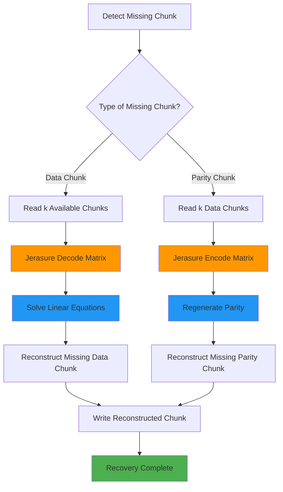

# SizeCeph vs Reed-Solomon: Data Flow Analysis

## Overview

This document provides a detailed comparison of data flows between SizeCeph and Reed-Solomon erasure coding algorithms, highlighting the fundamental architectural differences that led to the restructuring of SizeCeph integration in Ceph.

## Key Architectural Differences

| Aspect | Reed-Solomon (Jerasure) | SizeCeph |
|--------|-------------------------|----------|
| **Data Model** | Data Preservation | Data Transformation |
| **Data Chunks** | Original data unchanged | All chunks contain mixed data |
| **Decode Requirement** | Conditional (only on erasures) | Always required |
| **Recovery Method** | Reconstruct missing chunks | Reconstruct entire object |
| **Integration Pattern** | Direct mapping | Always-decode architecture |

---

## Write Flow Comparison

### Reed-Solomon Write Flow

```mermaid
flowchart TD
    A[Original Data Object] --> B[Split into k Data Chunks]
    B --> C[Data Chunk 0: Original[0:n]]
    B --> D[Data Chunk 1: Original[n:2n]]
    B --> E[Data Chunk k-1: Original[(k-1)n:kn]]
    
    C --> F[Encode: Generate m Parity Chunks]
    D --> F
    E --> F
    
    F --> G[Parity Chunk 0: P0 = f(D0,D1...Dk-1)]
    F --> H[Parity Chunk 1: P1 = g(D0,D1...Dk-1)]
    F --> I[Parity Chunk m-1: Pm-1 = h(D0,D1...Dk-1)]
    
    C --> J[Store: k Data + m Parity = k+m Total]
    D --> J
    E --> J
    G --> J
    H --> J
    I --> J
    
    J --> K[Data Chunks: UNCHANGED Original Data]
    J --> L[Parity Chunks: Computed from Data]
    
    style C fill:#e1f5fe
    style D fill:#e1f5fe  
    style E fill:#e1f5fe
    style G fill:#ffecb3
    style H fill:#ffecb3
    style I fill:#ffecb3
    style K fill:#c8e6c9
    style L fill:#ffcdd2
```

#### Reed-Solomon Characteristics:
- **Data Preservation**: First k chunks contain original data unchanged
- **Parity Generation**: m parity chunks computed from data chunks  
- **Storage Overhead**: m additional chunks for fault tolerance
- **Read Optimization**: Can read directly from data chunks

### SizeCeph Write Flow

```mermaid
flowchart TD
    A[Original Data Object] --> B[Interleave Data Across K Chunks]
    B --> C[Input Chunk 0: Mixed[0,k,2k,3k...]]
    B --> D[Input Chunk 1: Mixed[1,k+1,2k+1...]]
    B --> E[Input Chunk 2: Mixed[2,k+2,2k+2...]]
    B --> F[Input Chunk 3: Mixed[3,k+3,2k+3...]]
    
    C --> G[SIZE Algorithm: Transform All Data]
    D --> G
    E --> G
    F --> G
    
    G --> H[Transform Chunk 0: T0 = size_func(C0,C1,C2,C3)]
    G --> I[Transform Chunk 1: T1 = size_func(C0,C1,C2,C3)]
    G --> J[Transform Chunk 2: T2 = size_func(C0,C1,C2,C3)]
    G --> K[Transform Chunk 3: T3 = size_func(C0,C1,C2,C3)]
    G --> L[Transform Chunk 4: T4 = size_func(C0,C1,C2,C3)]
    G --> M[Transform Chunk 5: T5 = size_func(C0,C1,C2,C3)]
    G --> N[Transform Chunk 6: T6 = size_func(C0,C1,C2,C3)]
    G --> O[Transform Chunk 7: T7 = size_func(C0,C1,C2,C3)]
    G --> P[Transform Chunk 8: T8 = size_func(C0,C1,C2,C3)]
    
    H --> Q[Store: 9 Transformed Chunks]
    I --> Q
    J --> Q
    K --> Q
    L --> Q
    M --> Q
    N --> Q
    O --> Q
    P --> Q
    
    Q --> R[All Chunks: TRANSFORMED Data Mixed]
    
    style C fill:#e1f5fe
    style D fill:#e1f5fe  
    style E fill:#e1f5fe
    style F fill:#e1f5fe
    style H fill:#ffecb3
    style I fill:#ffecb3
    style J fill:#ffecb3
    style K fill:#ffecb3
    style L fill:#ffecb3
    style M fill:#ffecb3
    style N fill:#ffecb3
    style O fill:#ffecb3
    style P fill:#ffecb3
    style R fill:#ffcdd2
```

#### SizeCeph Characteristics:
- **Data Transformation**: All 9 chunks contain mixed/transformed data
- **No Pure Data Chunks**: Original data distributed across all chunks
- **SIZE Algorithm**: Proprietary transformation providing fault tolerance
- **Always-Decode Required**: Must decode to access original data

---

## Read Flow Comparison

### Reed-Solomon Read Flow (Normal Case - No Failures)

```mermaid
flowchart TD
    A[Read Request] --> B{Any Chunks Missing?}
    B -->|No| C[Read k Data Chunks Directly]
    B -->|Yes| D[Conditional Decode Path]
    
    C --> E[Chunk 0: Original[0:n]]
    C --> F[Chunk 1: Original[n:2n]]
    C --> G[Chunk k-1: Original[(k-1)n:kn]]
    
    E --> H[Concatenate Data Chunks]
    F --> H
    G --> H
    
    H --> I[Return Original Data]
    
    D --> J[Read Available k Chunks]
    J --> K[Jerasure Decode]
    K --> L[Reconstruct Missing Chunks]
    L --> M[Extract Required Data]
    M --> I
    
    style C fill:#c8e6c9
    style H fill:#c8e6c9
    style I fill:#4caf50
    style K fill:#ff9800
```

#### Reed-Solomon Read Advantages:
- **Direct Access**: No decoding when all data chunks available
- **Conditional Decode**: Only decode when chunks are missing
- **Performance**: Fast reads from unchanged data chunks
- **Selective Recovery**: Only reconstruct what's needed

### SizeCeph Read Flow (Always-Decode Architecture)

```mermaid
flowchart TD
    A[Read Request] --> B[Read All Available Chunks]
    B --> C[Check Minimum Requirements]
    C --> D{At Least K=4 Chunks Available?}
    
    D -->|No| E[ERROR: Insufficient Chunks]
    D -->|Yes| F[SIZE Decode: Always Required]
    
    B --> G[Transform Chunk 0: Mixed Data]
    B --> H[Transform Chunk 1: Mixed Data] 
    B --> I[Transform Chunk 2: Mixed Data]
    B --> J[Transform Chunk 3: Mixed Data]
    B --> K[Transform Chunk 4: Mixed Data]
    B --> L[Transform Chunk 5: Mixed Data]
    B --> M[Transform Chunk 6: Mixed Data]
    B --> N[Transform Chunk 7: Mixed Data]
    B --> O[Transform Chunk 8: Mixed Data]
    
    G --> F
    H --> F
    I --> F
    J --> F
    K --> F
    L --> F
    M --> F
    N --> F
    O --> F
    
    F --> P[size_restore_func(available_chunks)]
    P --> Q[Reconstruct Original Interleaved Data]
    Q --> R[Deinterleave Back to Sequential]
    R --> S[Return Original Data]
    
    style F fill:#ff9800
    style P fill:#ff9800
    style Q fill:#ff9800
    style R fill:#ff9800
    style S fill:#4caf50
```

#### SizeCeph Read Requirements:
- **Always Decode**: Must decode even with all chunks available
- **All-Chunk Processing**: Uses all available chunks for reconstruction
- **Transformation Reversal**: size_restore_func reverses SIZE algorithm
- **Higher CPU**: More computation required per read

---

## Rebuild Flow Comparison

### Reed-Solomon Rebuild Flow (Missing Chunk Recovery)



#### Reed-Solomon Rebuild Characteristics:
- **Selective Recovery**: Only reconstruct the missing chunk(s)
- **Mathematical Precision**: Linear algebra based reconstruction
- **Minimal I/O**: Read exactly k chunks to recover any missing chunk
- **Efficient**: Targeted recovery without processing entire object

### SizeCeph Rebuild Flow (Missing Chunk Recovery)

```mermaid
flowchart TD
    A[Detect Missing Chunk(s)] --> B[Read All Available Chunks]
    B --> C{At Least K=4 Available?}
    
    C -->|No| D[ERROR: Cannot Recover]
    C -->|Yes| E[Full Object Reconstruction]
    
    B --> F[Available Transform Chunks]
    F --> G[size_restore_func(available)]
    G --> H[Reconstruct Complete Original Data]
    H --> I[Re-interleave Original Data]
    I --> J[size_split_func(original)]
    J --> K[Regenerate All 9 Transform Chunks]
    K --> L[Extract Missing Chunk(s)]
    L --> M[Write Missing Chunk(s)]
    M --> N[Recovery Complete]
    
    style E fill:#ff5722
    style G fill:#ff9800
    style H fill:#ff9800
    style J fill:#ff9800
    style K fill:#ff9800
    style N fill:#4caf50
```

#### SizeCeph Rebuild Characteristics:
- **Full Reconstruction**: Must reconstruct entire original object
- **Re-encode Process**: Regenerate all chunks to extract missing ones
- **Higher Overhead**: More computation and I/O than selective recovery
- **Consistent Algorithm**: Same process regardless of which chunks are missing

---

## Integration Architecture Comparison

### Jerasure Framework Integration (Reed-Solomon)

```mermaid
flowchart TD
    A[Ceph OSD Read Request] --> B[ErasureCodeInterface]
    B --> C[ErasureCodeJerasure]
    C --> D{Erasures Present?}
    
    D -->|No| E[Direct Data Chunk Access]
    D -->|Yes| F[jerasure_decode()]
    
    E --> G[Return Data Chunks]
    F --> H[Linear Algebra Recovery]
    H --> I[Return Reconstructed Data]
    
    G --> J[Original Data Available]
    I --> J
    
    style E fill:#c8e6c9
    style F fill:#ff9800
    style J fill:#4caf50
```

### Independent SizeCeph Integration (New Architecture)

```mermaid
flowchart TD
    A[Ceph OSD Read Request] --> B[ErasureCodeInterface]
    B --> C[ErasureCodeSizeCeph]
    C --> D[Always-Decode Logic]
    
    D --> E[minimum_to_decode(): All Available]
    E --> F[decode(): Always Called]
    F --> G[size_restore_func()]
    G --> H[Object Reconstruction]
    H --> I[Return Original Data]
    
    style D fill:#ff5722
    style F fill:#ff9800
    style G fill:#ff9800
    style I fill:#4caf50
```

---

## Performance Implications

### Read Performance Comparison

| Scenario | Reed-Solomon | SizeCeph |
|----------|--------------|----------|
| **All Chunks Available** | Direct read (fast) | Always decode (slower) |
| **1-2 Chunks Missing** | Conditional decode | Always decode |
| **3+ Chunks Missing** | Conditional decode | Always decode |
| **CPU Usage** | Low (normal reads) | High (always decode) |
| **I/O Pattern** | Selective chunk reads | All available chunks |

### Write Performance Comparison

| Aspect | Reed-Solomon | SizeCeph |
|--------|--------------|----------|
| **Encoding Complexity** | Linear algebra (moderate) | SIZE algorithm (varies) |
| **Data Preparation** | Simple splitting | Interleaving required |
| **Chunk Generation** | k data + m parity | 9 transformed chunks |
| **Memory Usage** | k + m buffers | 9 transformation buffers |

### Fault Tolerance Comparison

| Configuration | Reed-Solomon (k=4, m=5) | SizeCeph (k=4, m=5) |
|---------------|--------------------------|---------------------|
| **Total Chunks** | 9 (4 data + 5 parity) | 9 (all transformed) |
| **Failure Tolerance** | Up to 5 chunk failures | Up to 5 chunk failures |
| **Recovery Efficiency** | Selective reconstruction | Full object reconstruction |
| **Minimum for Recovery** | Any 4 chunks | Any 4 chunks |

---

## Architectural Decision Impact

### Why Jerasure Integration Failed

1. **Conditional vs Always-Decode Mismatch**
   ```cpp
   // Jerasure framework assumption
   if (erasures_count > 0) {
       jerasure_decode();  // Only decode on failures
   }
   
   // SizeCeph requirement
   always {
       size_restore_func();  // Always decode required
   }
   ```

2. **Data Model Incompatibility**
   ```cpp
   // Reed-Solomon: First k chunks are original data
   data_chunks[0] = original_data[0:chunk_size];
   data_chunks[1] = original_data[chunk_size:2*chunk_size];
   
   // SizeCeph: All chunks are transformed
   all_chunks[i] = size_split_func(original_data)[i];  // Mixed data
   ```

### Why Independent Plugin Succeeds

1. **Always-Decode Architecture**
   ```cpp
   // SizeCeph can implement its natural flow
   int minimum_to_decode(...) {
       return all_available_chunks;  // Always need all available
   }
   
   int decode(...) {
       return size_restore_func(chunks);  // Always decode
   }
   ```

2. **Clean Separation**
   - No Reed-Solomon assumptions
   - Custom optimization opportunities
   - Natural algorithm implementation

---

## Conclusion

The fundamental difference between Reed-Solomon's **data preservation** model and SizeCeph's **data transformation** model necessitated the architectural restructuring. Reed-Solomon optimizes for conditional decoding with unchanged data chunks, while SizeCeph requires always-decode with transformed data distribution.

The new independent plugin architecture allows SizeCeph to:
- Implement its natural always-decode flow
- Optimize for its specific data transformation model  
- Avoid conflicts with Reed-Solomon assumptions
- Provide a clean foundation for algorithm-specific optimizations

This architectural alignment enables proper implementation of SizeCeph's fault-tolerance capabilities while maintaining Ceph's erasure code plugin framework compatibility.

---

**Date**: October 7, 2025  
**Architecture**: Independent SizeCeph Plugin  
**Status**: Successfully restructured for always-decode compatibility